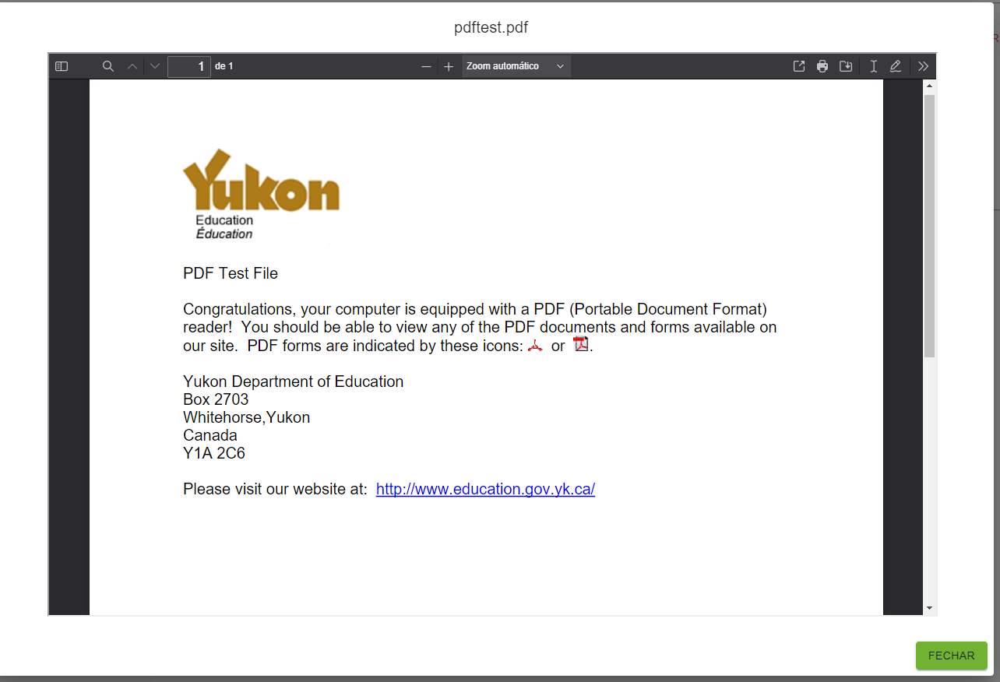

# FileViewerField

Render PDF or Image files in material ui [Dialog](https://mui.com/material-ui/react-dialog/)


This component uses [PDFjs](https://mozilla.github.io/pdf.js/) make sure to download PDFjs files and add them to the public folder with the folder name **pdfjs** \
\
Make sure to update the **HOSTED\_VIEWER\_ORIGINS** variable in viewer.js to add your frontend domains


```tsx
import { FileViewerField } from '@ra-libs/react';

<FileViewerField
  source="<source>"
  typeSource="mimeType"
  title="fileTitle"
  useLabel
/>;
```

it renders a button with the file title name


<figure><figcaption></figcaption></figure>

<figure><figcaption></figcaption></figure>
